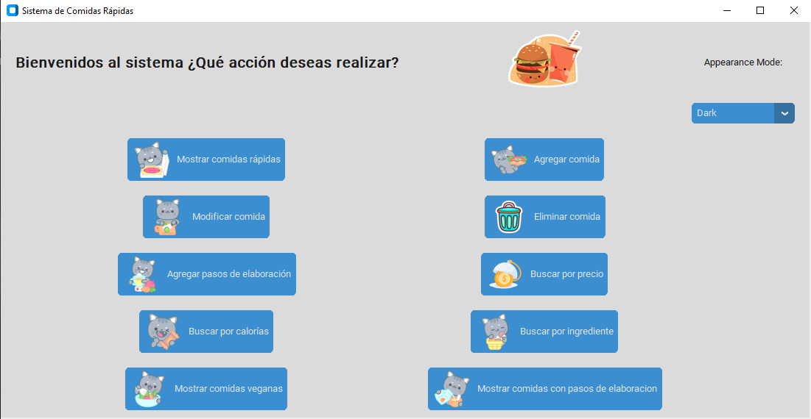

# Proyecto Final - Sistema de Comidas Rápidas

Proyecto realizado en Python con la biblioteca Tkinter y CustomTkinter para la Tecnicatura en Desarrollo Web de la Universidad de Entre Ríos. 

El proyecto consiste en una interfaz que permite al usuario realizar la manipulacion de un json mediante diferentes funciones.



### Requisitos previos.


* Deben tener instalado [Python y pip](https://www.python.org/downloads/). Se procederán las instrucciones con un entorno virtual.
* ⚠ Las instrucciones que inician en "python" pueden variar a "python3" con SO Linux.

## Instalación de la biblioteca Custom Tkinter y Tkinter

En la carpeta raíz del proyecto, ejecuta los siguientes comandos para instalar la biblioteca custom tkinter y pillow para las imagenes:


```bash
pip install customtkinter
```

  
```bash
pip install pillow   
```

**asegúrate de tener todos los archivos en la misma carpeta y el archivo .py y el .json al mismo nivel con la carpeta img**